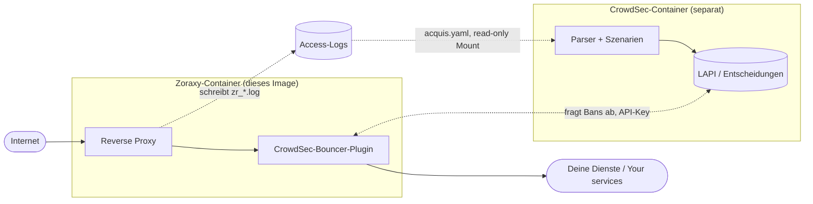

<div align="center">


# Zoraxy CrowdSec Bouncer

**Zoraxy Reverse Proxy mit vorinstalliertem CrowdSec-Bouncer-Plugin — fertig für Unraid und Docker.**

<sub>Zoraxy reverse proxy with the CrowdSec bouncer plugin pre-installed — ready for Unraid and Docker.</sub>

[](https://github.com/s3lfcod3r/zoraxy-crowdsec-bouncer/actions/workflows/docker-build.yml)
[](https://github.com/s3lfcod3r/zoraxy-crowdsec-bouncer/actions/workflows/auto-update.yml)


**[🇩🇪 Deutsch](#-deutsch)** · **[🇬🇧 English](#-english)** · **[Credits](#credits--lizenzen--licenses)**

</div>

---

## TL;DR

```bash
docker pull ghcr.io/s3lfcod3r/zoraxy-crowdsec-bouncer:latest
```

**Unraid Template-URL:**

```
https://raw.githubusercontent.com/s3lfcod3r/zoraxy-crowdsec-bouncer/main/unraid/zoraxy-crowdsec-bouncer.xml
```

| | |
|---|---|
| ✅ **Plugin vorinstalliert** | Kein manueller Download, kein Kompilieren |
| ✅ **`config.yaml` automatisch** | Wird beim Start aus den Container-Variablen erzeugt |
| ✅ **Auto-Update** | Workflow zieht alle 12 h neue Zoraxy-/Plugin-Versionen nach |
| ⚠️ **CrowdSec nicht enthalten** | Du brauchst eine eigene CrowdSec-Instanz (LAPI) |

---

## Wie das Ganze zusammenspielt / How the pieces fit together



**Kernpunkt:** Ohne den Log-Weg (gestrichelt) lernt CrowdSec nie neue Angreifer — der Bouncer blockt dann nur, was in der LAPI schon steht. Das ist mit Abstand der häufigste Konfigurationsfehler, siehe [Schritt 2](#schritt-2--zoraxy-logs-für-crowdsec-freigeben).

---

## Repo-Aufbau / Repository layout

| Pfad | Zweck |
|---|---|
| `Dockerfile` | Baut Zoraxy + Bouncer-Plugin in ein Image |
| `entrypoint.sh` | Erzeugt beim Start die Plugin-`config.yaml` aus den ENV-Variablen |
| `docker-compose.yml` | Lokaler Test ohne Unraid |
| `unraid/zoraxy-crowdsec-bouncer.xml` | Unraid-Container-Template |
| `ca_profile.xml` | Maintainer-Profil für Unraid Community Applications |
| `.github/workflows/` | Image-Build (`docker-build.yml`) + Versions-Auto-Update (`auto-update.yml`) |

---

# 🇩🇪 Deutsch

## Was ist das?

Dieses Docker-Image kombiniert [Zoraxy](https://github.com/tobychui/zoraxy) – einen modernen HTTP Reverse Proxy – mit dem [CrowdSec Bouncer Plugin](https://github.com/AnthonyMichaelTDM/zoraxy_crowdsec_bouncer), welches bösartige IPs automatisch blockiert.

- **Das Plugin ist bereits vorinstalliert** – du musst nichts manuell herunterladen.
- **Die Plugin-`config.yaml` wird beim Container-Start aus den Umgebungsvariablen erzeugt** – du trägst API Key und LAPI-URL in den Unraid-Einstellungen ein, ohne die Datei manuell zu bearbeiten.
- **CrowdSec selbst ist nicht enthalten** – du benötigst eine separate CrowdSec-Instanz (z. B. als eigener Docker-Container).

### Enthaltene Komponenten

| Komponente | Version |
|---|---|
| Zoraxy | wird automatisch aktuell gehalten |
| CrowdSec Bouncer Plugin | wird automatisch aktuell gehalten |

> Die exakt gebauten Versionen stehen als `ARG ZORAXY_VERSION` / `ARG PLUGIN_VERSION` oben im [`Dockerfile`](Dockerfile) und werden vom Auto-Update-Workflow gepflegt.

---

## Umgebungsvariablen

Diese Werte trägst du direkt in Unraid (oder docker-compose) ein – die `config.yaml` wird beim ersten Start automatisch daraus erstellt.

| Variable | Standard | Pflicht? | Beschreibung |
|---|---|---|---|
| `CROWDSEC_API_KEY` | *(leer)* | ✅ Ja | API Key deiner CrowdSec-Instanz |
| `CROWDSEC_AGENT_URL` | `http://crowdsec:8080` | ✅ Ja | URL deiner CrowdSec-Instanz |
| `CROWDSEC_LOG_LEVEL` | `warning` | ❌ Nein | Log-Level: `trace` / `debug` / `info` / `warning` / `error` |
| `CROWDSEC_CLOUDFLARE` | `false` | ❌ Nein | `true` wenn Zoraxy hinter Cloudflare läuft |
| `FASTGEOIP` | `true` | ❌ Nein | Schnelle GeoIP-Datenbank |
| `DOCKER` | `true` | ❌ Nein | Docker-Kompatibilitätsmodus |

> 💡 Die Plugin-`config.yaml` wird **bei jedem Start** aus den Container-Variablen geschrieben. Manuelle Änderungen an der Datei werden beim nächsten Neustart überschrieben – Werte also lieber in Unraid unter den Umgebungsvariablen pflegen.

## Ports

| Port | Beschreibung | Änderbar? |
|------|-------------|-----------|
| `80` | HTTP-Traffic | ✅ Ja |
| `443` | HTTPS-Traffic | ✅ Ja |
| `8000` | Zoraxy WebUI (Verwaltung) | ✅ Ja |

## Volumes / Pfade

| Container-Pfad | Beschreibung | Unraid Standard-Pfad |
|---|---|---|
| `/opt/zoraxy/config/` | Zoraxy Konfiguration, Zertifikate, Logs | `/mnt/user/appdata/zoraxy/config` |
| `/opt/zoraxy/plugin/` | Plugin-Daten inkl. automatisch erstellter `config.yaml` | `/mnt/user/appdata/zoraxy/plugin` |
| `/var/run/docker.sock` | Docker-Socket (für Docker-Modus) | `/var/run/docker.sock` |
| `/etc/localtime` | Zeitzone vom Host | `/etc/localtime` |

---

## Unraid Installation

### Methode 1 – Über Community Applications

1. Öffne **Community Applications** in Unraid
2. Suche nach `zoraxy-crowdsec-bouncer`
3. Klicke **Install**
4. Passe die Einstellungen wie unten beschrieben an

### Methode 2 – Template manuell hinzufügen

1. Gehe in Unraid zu **Docker** → **Add Container**
2. Scrolle ganz unten zu **Template URL** und füge ein:
   ```
   https://raw.githubusercontent.com/s3lfcod3r/zoraxy-crowdsec-bouncer/main/unraid/zoraxy-crowdsec-bouncer.xml
   ```
3. Klicke **Load** – das Template wird automatisch befüllt

<details>
<summary><b>Unraid-Einstellungen im Detail</b> — Pflichtfelder, erweiterte Felder, Ports & Pfade anpassen</summary>

### Pflichtfelder (immer sichtbar)

| Feld | Beispiel | Beschreibung |
|------|---------|-------------|
| **CrowdSec API Key** | `abc123xyz...` | Wird beim Eintippen versteckt (masked) |
| **CrowdSec Agent URL** | `http://192.168.1.100:8080` | IP deines CrowdSec Containers |
| **WebUI Port** | `8000` | Zoraxy Verwaltungsoberfläche |
| **HTTP Port** | `80` | HTTP-Traffic |
| **HTTPS Port** | `443` | HTTPS-Traffic |
| **Config Folder** | `/mnt/user/appdata/zoraxy/config` | Zoraxy Konfigurationsdaten |
| **Plugin Folder** | `/mnt/user/appdata/zoraxy/plugin` | Plugin inkl. `config.yaml` |

### Erweiterte Felder (unter "Advanced")

| Feld | Standard | Beschreibung |
|------|---------|-------------|
| Log Level | `warning` | Wie viel der Bouncer loggt |
| Cloudflare Proxy | `false` | `true` wenn du Cloudflare nutzt |
| Fast GeoIP | `true` | GeoIP-Datenbank |
| Docker Mode | `true` | Docker-Kompatibilität |

### Ports anpassen

Falls Port 80 oder 443 bereits belegt sind:

| Feld | Standard | Beispiel geändert | Hinweis |
|------|---------|-------------------|---------|
| Host Port HTTP | `80` | `8080` | Nur den Host-Port ändern, Container-Port bleibt `80` |
| Host Port HTTPS | `443` | `8443` | Nur den Host-Port ändern, Container-Port bleibt `443` |
| Host Port WebUI | `8000` | `9000` | Zoraxy Verwaltungsoberfläche |

> ⚠️ Ändere **nur** den linken Wert (Host-Port), nicht den rechten (Container-Port)!

### Pfade anpassen

| Feld | Standard | Alternative (SSD/Cache) |
|------|---------|------------------------|
| Config Pfad | `/mnt/user/appdata/zoraxy/config` | `/mnt/cache/appdata/zoraxy/config` |
| Plugin Pfad | `/mnt/user/appdata/zoraxy/plugin` | `/mnt/cache/appdata/zoraxy/plugin` |

> 💡 Tipp: Nutze `/mnt/cache/appdata/` wenn du eine SSD als Cache-Laufwerk hast – das ist schneller.

</details>

---

## CrowdSec auf Unraid einrichten (Voraussetzung)

Dieses Image enthält **nur den Bouncer in Zoraxy** – CrowdSec selbst installierst du separat. Ohne CrowdSec erkennt das System keine neuen Angreifer; der Bouncer blockiert nur IPs, die CrowdSec bereits in der LAPI kennt.

**Kurzüberblick – so hängt alles zusammen:**

1. CrowdSec-Container (Community Applications) installieren
2. Zoraxy-**Logs** in CrowdSec einbinden (`acquis.yaml` + Volume)
3. Zoraxy-**Collection** im Hub installieren (Parser für `type: zoraxy`)
4. **Bouncer** anlegen → API-Key ins Zoraxy-Image
5. Zoraxy-Container: LAPI-URL + Plugin + **Tags** (siehe unten)

> 📖 CrowdSec-Unraid-Template (IBRACORP): [docs.ibracorp.io](https://docs.ibracorp.io) · Zoraxy-Diskussion: [tobychui/zoraxy#338](https://github.com/tobychui/zoraxy/discussions/338)

### Schritt 1 – CrowdSec aus Community Applications

1. In Unraid **Community Applications** öffnen
2. Nach **`crowdsec`** suchen (Entwickler: **crowdsecurity**, Maintainer z. B. IBRACORP)
3. Container installieren und starten
4. Merken: **Container-Name** (oft `crowdsec`) und wo die Config auf dem Host liegt (z. B. `/mnt/user/Docker/crowdsec/` oder `/mnt/user/appdata/crowdsec/`)

Die LAPI ist standardmäßig unter Port **8080** erreichbar.

### Schritt 2 – Zoraxy-Logs für CrowdSec freigeben

CrowdSec muss die Zoraxy-Access-Logs lesen (`zr_*.log`, monatliches Rollover). Dafür brauchst du **zwei Dinge**: ein Volume im CrowdSec-Container und eine `acquis.yaml`.

**a) Volume im CrowdSec-Container (Unraid)** – dort **Path hinzufügen** (Werte an dein Setup anpassen):

| Host-Pfad (Beispiel) | Container-Pfad | Modus |
|----------------------|------------------|-------|
| `/mnt/user/appdata/zoraxy/config/log` | `/var/log/zoraxy` | `ro` |

**Host-Pfad finden:** Dort liegen die Dateien `zr_*.log` – oft unter dem Zoraxy-**Config**-Volume in einem Unterordner `log/`. Wenn dein Config-Pfad abweicht, den Ordner mit den `zr_*.log` auf dem Host wählen.

> Beispiel aus einem funktionierenden Setup: Host-Config unter `/mnt/user/Docker/crowdsec/`, Zoraxy-Logs vom Config-Volume nach `/var/log/zoraxy` im CrowdSec-Container gemountet.

**b) `acquis.yaml` anlegen** – Datei auf dem Host im CrowdSec-Config-Ordner, z. B. `/mnt/user/Docker/crowdsec/acquis.yaml` (bzw. wo dein Template `/etc/crowdsec` mapped – Pfad anpassen):

```yaml
---
filenames:
  - "/var/log/zoraxy/zr_*.log"   ## Alle Zoraxy-Logs (monatliches Rollover)
labels:
  type: "zoraxy"                ## Muss zum installierten Parser passen
```

Der Pfad in `filenames` ist der **Pfad im CrowdSec-Container** (also `/var/log/zoraxy/...`), nicht der Unraid-Host-Pfad.

Manche Setups nutzen statt einer einzelnen `acquis.yaml` Dateien unter `/etc/crowdsec/acquis.d/` – dann dieselbe Konfiguration z. B. als `zoraxy.yaml` dort ablegen.

**CrowdSec-Container danach neu starten.**

### Schritt 3 – Zoraxy-Collection (Parser) installieren

Damit CrowdSec die Logs auswerten kann, die Collection mit Zoraxy-Parser installieren:

```bash
docker exec -it crowdsec cscli collections install raithmir/zoraxy-logs
```

Hub-Übersicht: [Raithmir – zoraxy collection](https://app.crowdsec.net/hub/author/Raithmir/collections/zoraxy)

Optional prüfen:

```bash
docker exec -it crowdsec cscli collections list
docker exec -it crowdsec cscli metrics
```

### Schritt 4 – Netzwerk: Zoraxy ↔ CrowdSec LAPI

Der Zoraxy-Container muss die CrowdSec-**LAPI** erreichen (Port 8080).

**Option A – Gleiches benutzerdefiniertes Docker-Netzwerk (empfohlen)**
Beide Container im selben Custom Network; dann z. B. `CROWDSEC_AGENT_URL=http://crowdsec:8080` (`crowdsec` = Container-Name von CrowdSec).

**Option B – Bridge / unterschiedliche Netzwerke**
IP des Unraid-Hosts oder des CrowdSec-Containers verwenden, z. B. `CROWDSEC_AGENT_URL=http://192.168.1.10:8080`.

### Schritt 5 – Bouncer anlegen & Zoraxy verbinden

Bouncer in CrowdSec registrieren (Name frei wählbar):

```bash
docker exec -it crowdsec cscli bouncers add zoraxy-bouncer
```

Den angezeigten **API-Key** kopieren und im **Zoraxy-CrowdSec-Bouncer**-Container eintragen:

- **CrowdSec API Key** = der Key von oben
- **CrowdSec Agent URL** = LAPI-URL aus Schritt 4

Danach Zoraxy-Container neu starten.

### Schritt 6 – Prüfen ob die Kette funktioniert

```bash
# Bouncer registriert?
docker exec -it crowdsec cscli bouncers list

# Kommen Entscheidungen an? (nach etwas Traffic über Zoraxy)
docker exec -it crowdsec cscli decisions list

# Laufen Metriken / Parser?
docker exec -it crowdsec cscli metrics
```

Wenn `decisions list` leer bleibt: zuerst Logs (`acquis.yaml`, Volume, `zr_*.log`-Pfad) und Collection prüfen – **ohne Logs keine neuen Bans**.

---

## Plugin in Zoraxy aktivieren

Nach dem ersten Start:

1. Öffne die Zoraxy WebUI: `http://DEINE-UNRAID-IP:8000`
2. Gehe zu **Plugins** – der CrowdSec Bouncer sollte erscheinen → **Aktivieren**
3. Gehe zu **Tags** → Neuen Tag erstellen (z. B. `crowdsec-protected`)
4. Tag bei allen Proxy-Regeln hinzufügen, die du schützen möchtest

## Häufige Probleme

| Symptom | Was zu prüfen ist |
|---|---|
| **Plugin erscheint nicht in der WebUI** | Plugin-Pfad korrekt gemountet? Container neu starten. |
| **`config.yaml` hat falschen API Key** | Datei unter `/mnt/user/appdata/zoraxy/plugin/zoraxycrowdsecbouncer/config.yaml` löschen und Container neu starten – sie wird mit den aktuellen Variablen neu erstellt. |
| **CrowdSec API nicht erreichbar** | Zoraxy und CrowdSec im selben Docker-Netzwerk? Alternativ direkte IP: `http://192.168.1.xxx:8080` |
| **Keine Bans / leere `cscli decisions list`** | Zoraxy-Logs in CrowdSec gemountet (`/var/log/zoraxy/zr_*.log` im Container sichtbar)? `acquis.yaml` mit `type: zoraxy` vorhanden? `cscli collections install raithmir/zoraxy-logs` ausgeführt? Läuft Traffic über Proxy-Regeln mit aktiviertem Plugin-**Tag**? |
| **Port bereits belegt** | Host-Port in den Unraid Container-Einstellungen ändern (nur den linken Wert!) |

---

# 🇬🇧 English

<details>
<summary><b>Click to expand the full English documentation</b></summary>

## What is this?

This Docker image combines [Zoraxy](https://github.com/tobychui/zoraxy) – a modern HTTP reverse proxy – with the [CrowdSec Bouncer Plugin](https://github.com/AnthonyMichaelTDM/zoraxy_crowdsec_bouncer), which automatically blocks malicious IPs.

- **The plugin is pre-installed** – no manual download required.
- **The plugin `config.yaml` is generated on container start from environment variables** – enter your CrowdSec API key and LAPI URL in Unraid, no manual file editing required.
- **CrowdSec itself is not included** – you need a separate CrowdSec instance (e.g. as its own Docker container).

### Included Components

| Component | Version |
|---|---|
| Zoraxy | kept up to date automatically |
| CrowdSec Bouncer Plugin | kept up to date automatically |

> The exact pinned versions live as `ARG ZORAXY_VERSION` / `ARG PLUGIN_VERSION` at the top of the [`Dockerfile`](Dockerfile) and are maintained by the auto-update workflow.

## Environment Variables

Enter these values directly in Unraid (or docker-compose) – the `config.yaml` is created automatically on first start.

| Variable | Default | Required? | Description |
|---|---|---|---|
| `CROWDSEC_API_KEY` | *(empty)* | ✅ Yes | API key of your CrowdSec instance |
| `CROWDSEC_AGENT_URL` | `http://crowdsec:8080` | ✅ Yes | URL of your CrowdSec instance |
| `CROWDSEC_LOG_LEVEL` | `warning` | ❌ No | Log level: `trace` / `debug` / `info` / `warning` / `error` |
| `CROWDSEC_CLOUDFLARE` | `false` | ❌ No | `true` if Zoraxy runs behind Cloudflare |
| `FASTGEOIP` | `true` | ❌ No | Enable fast GeoIP database |
| `DOCKER` | `true` | ❌ No | Docker compatibility mode |

> 💡 The plugin `config.yaml` is **rewritten on every container start** from the environment variables. Edit values in Unraid rather than hand-editing the file.

## Ports

| Port | Description | Changeable? |
|------|-------------|-------------|
| `80` | HTTP traffic | ✅ Yes |
| `443` | HTTPS traffic | ✅ Yes |
| `8000` | Zoraxy WebUI (management) | ✅ Yes |

## Volumes / Paths

| Container Path | Description | Unraid Default Path |
|---|---|---|
| `/opt/zoraxy/config/` | Zoraxy config, certificates, logs | `/mnt/user/appdata/zoraxy/config` |
| `/opt/zoraxy/plugin/` | Plugin data incl. auto-created `config.yaml` | `/mnt/user/appdata/zoraxy/plugin` |
| `/var/run/docker.sock` | Docker socket (for Docker mode) | `/var/run/docker.sock` |
| `/etc/localtime` | Timezone from host | `/etc/localtime` |

## Unraid Installation

**Method 1 – Via Community Applications**

1. Open **Community Applications** in Unraid
2. Search for `zoraxy-crowdsec-bouncer`
3. Click **Install**
4. Adjust the settings as described below

**Method 2 – Add template manually**

1. Go to Unraid **Docker** → **Add Container**
2. Scroll to the bottom and find **Template URL**, paste:
   ```
   https://raw.githubusercontent.com/s3lfcod3r/zoraxy-crowdsec-bouncer/main/unraid/zoraxy-crowdsec-bouncer.xml
   ```
3. Click **Load** – the template fills in automatically

### Unraid Settings

**Required fields (always visible)**

| Field | Example | Description |
|-------|---------|-------------|
| **CrowdSec API Key** | `abc123xyz...` | Hidden when typing (masked) |
| **CrowdSec Agent URL** | `http://192.168.1.100:8080` | IP of your CrowdSec container |
| **WebUI Port** | `8000` | Zoraxy management interface |
| **HTTP Port** | `80` | HTTP traffic |
| **HTTPS Port** | `443` | HTTPS traffic |
| **Config Folder** | `/mnt/user/appdata/zoraxy/config` | Zoraxy configuration data |
| **Plugin Folder** | `/mnt/user/appdata/zoraxy/plugin` | Plugin incl. `config.yaml` |

**Advanced fields (under "Advanced")**

| Field | Default | Description |
|-------|---------|-------------|
| Log Level | `warning` | How much the bouncer logs |
| Cloudflare Proxy | `false` | `true` if you use Cloudflare |
| Fast GeoIP | `true` | GeoIP database |
| Docker Mode | `true` | Docker compatibility |

**Changing ports** — if port 80 or 443 are already in use:

| Field | Default | Example Changed | Note |
|-------|---------|-----------------|------|
| Host Port HTTP | `80` | `8080` | Only change the host port, container port stays `80` |
| Host Port HTTPS | `443` | `8443` | Only change the host port, container port stays `443` |
| Host Port WebUI | `8000` | `9000` | Zoraxy management interface |

> ⚠️ Only change the **left** value (host port), not the right one (container port)!

**Changing paths**

| Field | Default | Alternative (SSD/Cache) |
|-------|---------|------------------------|
| Config Path | `/mnt/user/appdata/zoraxy/config` | `/mnt/cache/appdata/zoraxy/config` |
| Plugin Path | `/mnt/user/appdata/zoraxy/plugin` | `/mnt/cache/appdata/zoraxy/plugin` |

> 💡 Tip: Use `/mnt/cache/appdata/` if you have an SSD as cache drive – it's faster.

## Set up CrowdSec on Unraid (prerequisite)

This image only ships the **bouncer inside Zoraxy**. You must run **CrowdSec separately**. Without CrowdSec analyzing traffic, the bouncer can only block IPs CrowdSec already knows via the LAPI.

**Overview – how the pieces fit together:**

1. Install the CrowdSec container (Community Applications)
2. Feed Zoraxy **logs** into CrowdSec (`acquis.yaml` + volume mount)
3. Install the Zoraxy **collection** from the Hub (parser for `type: zoraxy`)
4. Create a **bouncer** → paste API key into this Zoraxy image
5. Zoraxy container: LAPI URL + plugin + **tags** (see below)

> 📖 CrowdSec on Unraid (IBRACORP template): [docs.ibracorp.io](https://docs.ibracorp.io) · Zoraxy thread: [tobychui/zoraxy#338](https://github.com/tobychui/zoraxy/discussions/338)

**Step 1 – CrowdSec from Community Applications**

1. Open **Community Applications** on Unraid
2. Search for **`crowdsec`** (publisher **crowdsecurity**, maintainer e.g. IBRACORP)
3. Install and start the container
4. Note the **container name** (often `crowdsec`) and host config path (e.g. `/mnt/user/Docker/crowdsec/` or `/mnt/user/appdata/crowdsec/`)

LAPI is usually on port **8080**.

**Step 2 – Expose Zoraxy logs to CrowdSec**

CrowdSec must read Zoraxy access logs (`zr_*.log`, monthly rollover). You need a **volume mount** on the CrowdSec container and an **`acquis.yaml`**.

Add a **Path** mapping (adjust to your layout):

| Host path (example) | Container path | Mode |
|---------------------|------------------|------|
| `/mnt/user/appdata/zoraxy/config/log` | `/var/log/zoraxy` | `ro` |

**Find the host path:** use the directory that contains `zr_*.log` files — often under the Zoraxy **config** volume in a `log/` subfolder.

Create `acquis.yaml` on the host in your CrowdSec config folder, e.g. `/mnt/user/Docker/crowdsec/acquis.yaml` (match wherever your template maps `/etc/crowdsec`):

```yaml
---
filenames:
  - "/var/log/zoraxy/zr_*.log"   ## All Zoraxy logs (monthly rollover)
labels:
  type: "zoraxy"                  ## Must match the installed parser
```

Paths in `filenames` are **inside the CrowdSec container** (`/var/log/zoraxy/...`), not the Unraid host path.

Some setups use `/etc/crowdsec/acquis.d/` instead — same YAML as e.g. `zoraxy.yaml` there.

**Restart the CrowdSec container** after changes.

**Step 3 – Install Zoraxy collection (parser)**

```bash
docker exec -it crowdsec cscli collections install raithmir/zoraxy-logs
```

Hub: [Raithmir – zoraxy collection](https://app.crowdsec.net/hub/author/Raithmir/collections/zoraxy)

Optional checks:

```bash
docker exec -it crowdsec cscli collections list
docker exec -it crowdsec cscli metrics
```

**Step 4 – Network: Zoraxy ↔ CrowdSec LAPI**

The Zoraxy container must reach CrowdSec **LAPI** (port 8080).

- *Option A – Same custom Docker network (recommended):* both containers on one network, then e.g. `CROWDSEC_AGENT_URL=http://crowdsec:8080` (`crowdsec` = your CrowdSec container name).
- *Option B – Bridge / different networks:* use the Unraid host IP or CrowdSec container IP, e.g. `CROWDSEC_AGENT_URL=http://192.168.1.10:8080`.

**Step 5 – Create bouncer & connect Zoraxy**

```bash
docker exec -it crowdsec cscli bouncers add zoraxy-bouncer
```

Copy the **API key** into the **Zoraxy-CrowdSec-Bouncer** container:

- **CrowdSec API Key** = key from above
- **CrowdSec Agent URL** = LAPI URL from step 4

Restart the Zoraxy container.

**Step 6 – Verify the pipeline**

```bash
docker exec -it crowdsec cscli bouncers list
docker exec -it crowdsec cscli decisions list
docker exec -it crowdsec cscli metrics
```

If `decisions list` stays empty, fix logs first (`acquis.yaml`, volume, `zr_*.log` path) and the collection — **no logs means no new bans**.

## Activating the Plugin in Zoraxy

After the first start:

1. Open Zoraxy WebUI: `http://YOUR-UNRAID-IP:8000`
2. Go to **Plugins** – the CrowdSec Bouncer should appear → **Activate**
3. Go to **Tags** → Create a new tag (e.g. `crowdsec-protected`)
4. Add the tag to all proxy rules you want to protect

## Troubleshooting

| Symptom | What to check |
|---|---|
| **Plugin not showing in WebUI** | Is the plugin path correctly mounted? Restart the container. |
| **`config.yaml` has wrong API key** | Delete `/mnt/user/appdata/zoraxy/plugin/zoraxycrowdsecbouncer/config.yaml` and restart – it is recreated from the current variables. |
| **CrowdSec API not reachable** | Are Zoraxy and CrowdSec in the same Docker network? Otherwise use the direct IP: `http://192.168.1.xxx:8080` |
| **No bans / empty `cscli decisions list`** | Are Zoraxy logs mounted into CrowdSec (`/var/log/zoraxy/zr_*.log` visible in the container)? Is `acquis.yaml` with `type: zoraxy` present? Did you run `cscli collections install raithmir/zoraxy-logs`? Does traffic go through proxy rules with the plugin **tag** enabled? |
| **Port already in use** | Change the host port in the Unraid container settings (left value only!) |

</details>

---

## docker-compose (lokaler Test / local testing)

```yaml
services:
  zoraxy:
    image: ghcr.io/s3lfcod3r/zoraxy-crowdsec-bouncer:latest
    container_name: zoraxy
    restart: unless-stopped
    ports:
      - "80:80"
      - "443:443"
      - "8000:8000"
    volumes:
      - ./config:/opt/zoraxy/config/
      - ./plugin:/opt/zoraxy/plugin/
      - /var/run/docker.sock:/var/run/docker.sock
      - /etc/localtime:/etc/localtime
    extra_hosts:
      - "host.docker.internal:host-gateway"
    environment:
      - CROWDSEC_API_KEY=DEIN_API_KEY
      - CROWDSEC_AGENT_URL=http://crowdsec:8080
      - CROWDSEC_LOG_LEVEL=warning
      - CROWDSEC_CLOUDFLARE=false
      - FASTGEOIP=true
      - DOCKER=true
```

---

# Credits & Lizenzen / Licenses

Dieses Projekt verwendet folgende Open-Source-Software / This project uses the following open source software:

| Projekt / Project | Autor / Author | Lizenz / License | Link |
|---|---|---|---|
| Zoraxy | tobychui | AGPL v3 | https://github.com/tobychui/zoraxy |
| zoraxy_crowdsec_bouncer | AnthonyMichaelTDM | MIT | https://github.com/AnthonyMichaelTDM/zoraxy_crowdsec_bouncer |
| CrowdSec | CrowdSec | MIT | https://github.com/crowdsecurity/crowdsec |

**MIT License – zoraxy_crowdsec_bouncer** · Copyright (c) 2025 Anthony Rubick

Dieses Docker-Image / Template wird unabhängig gepflegt und ist nicht mit den oben genannten Projekten affiliiert.
This Docker image / template is independently maintained and is not affiliated with the projects listed above.
